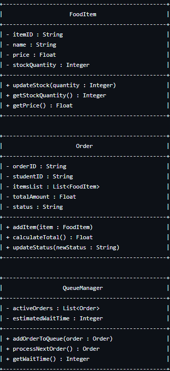
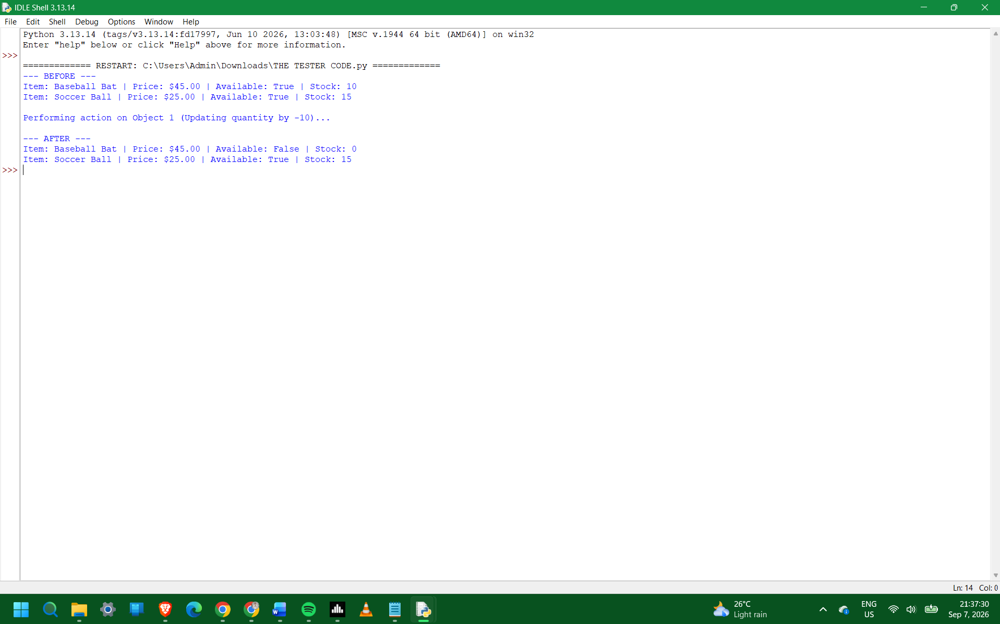
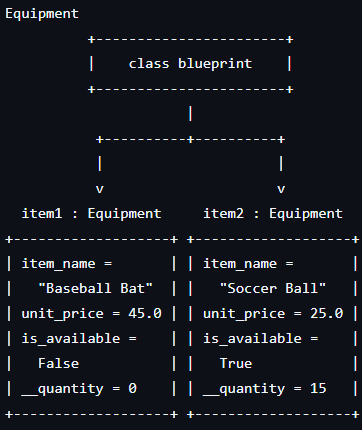

# MANGAOANG, KARL - IX-SILICON
# Class Attributes and Methods

## Previous Design
[classObjectUML.md](classObjectUML.md)

## Design Revision
No changes we're made on the UML except the file name was UMD and changed to UML.

## Visibility Decisions
|  Attribute  |  Data Type  |  Visibility  |  Why Public/Private?  |
|  item_name  |  string  |  Public  |  Standard information that can be freely viewed and identified outside the class.  |
|  unit_price  |  float  |  Public  |  Public pricing information that can be directly read for quotes or bills.  |
|  is_available  |  boolean  |  Public  |  General status flag showing whether the item is in stock or checked out.  |
|  quantity  |  int  |  Private  |  Sensitive stock count that should only be modified through validated methods to prevent negative values.  |

## Updated UML Class Diagram

## Python Implementation
[View Python Source](classImplementation.py)

## Test Run

## Object Diagram

## Analysis

### Why did you make your chosen attribute private? 

### The __quantity attribute was made private to protect internal inventory data from direct, unauthorized modification. If other parts of the program changed it directly, it could lead to invalid states like negative inventory counts or misaligned availability flags. Keeping it private ensures all updates pass through validation logic.

### Which method changes the state of your object?

### The update_quantity() method changes the state of the object by modifying the private __quantity attribute based on the integer amount passed in. If the resulting stock reaches zero, it also automatically changes the is_available attribute to False.

### How did your two objects demonstrate that instances are independent?

### The test output showed that calling update_quantity(-10) on item1 reduced its stock to 0 and changed its availability to False. Meanwhile, item2 retained its original stock of 15 and remained available (True). This proves that item1 and item2 occupy separate memory locations and manage independent states.

### What is the difference between your class diagram and your object diagram? 

### The class diagram defines the general structural blueprint of the Equipment class, listing data types and method signatures without specific instance values. In contrast, the object diagram shows real instances (item1 and item2) at a specific point in time, displaying their actual assigned values after code execution.
