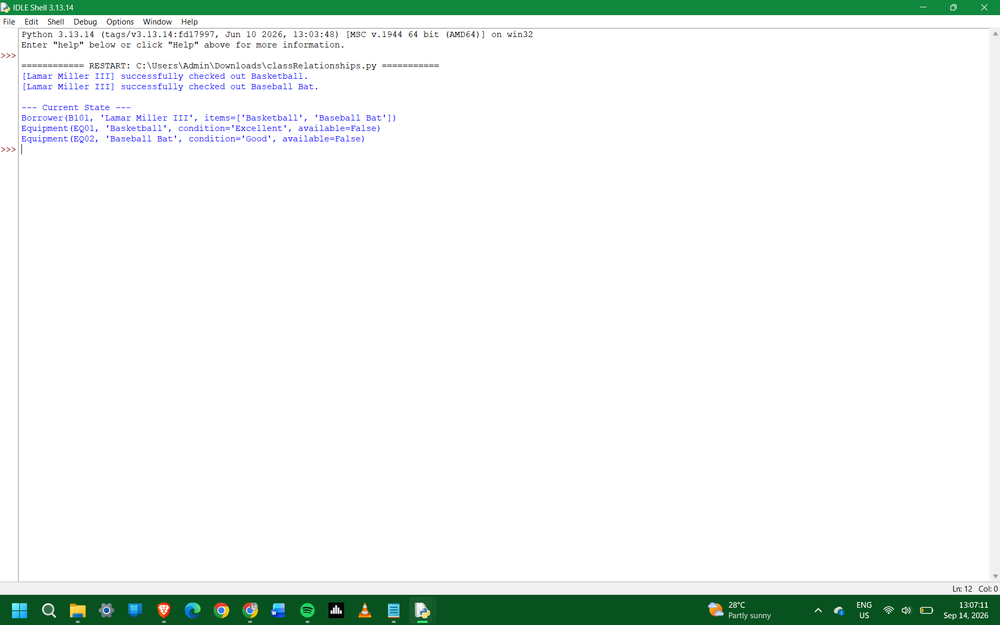

# Class Relationships: Association and Multiplicity
## Previous Work

[Part I - Classes and Objects](classObjectUML.md)
[Part II - Class Attributes and Methods](classAttributesMethods.md)

## Existing Class
Class: Sports - Equipment
Description: Tracks essential details like equipment type, condition, and availability.

## New Related Class
Class: Borrower (or Athlete / TeamMember)
Description: Represents an individual who checks out sports equipment, tracking details like borrower ID, name, contact info, and current checked-out items.

## Association
Relationship: One-to-Many (1 Borrower to 0..* Equipment) or Many-to-Many depending on system scope (e.g., Borrower borrows Equipment).
Explanation: A Borrower can check out multiple pieces of Equipment over time, while each specific piece of Equipment is currently assigned to at most one Borrower.

## UML Class Relationship Diagram

## Python Implementation
[View Python Source](classRelationships.py)

## Test Run

## Object Relationship Diagram

## Analysis
### What is the association between your two classes?
The association is a direct relationship between a Borrower and the Equipment they check out. The Borrower class manages or holds references to Equipment objects to track which items are currently in their possession.

### What multiplicity did you choose and why?
A 1-to-Many (1 : 0..*) multiplicity was chosen. One borrower can check out zero or multiple items at a time, but an individual physical piece of equipment can only be assigned to one borrower at a given moment.

### How did you implement the relationship in Python?
In Python, the Borrower class maintains an instance attribute initialized as a list (e.g., self.borrowed_equipment = []). Methods like checkout_equipment(equipment) append the target Equipment instance to this list, while return_equipment(equipment) removes it.

### Why did you store an object reference instead of copying its data?
Storing an object reference ensures data integrity and single source of truth. If the equipment's condition or availability status updates in the system, any class referencing that object immediately reflects those updates without needing manual sync across duplicate data copies.

### If your relationship uses many, why is a list appropriate?
A list is appropriate because it is a dynamic, ordered collection that easily supports appending, removing, and iterating over multiple Equipment objects as items are checked out or returned over time.
